# Selected Research Figures

This page collects public-facing figure examples that show how growth, structural characterization, and morphology feedback are used to evaluate MBE heterostructures. The figures are sanitized slide or figure exports: sample identifiers, internal notes, exact run context, and private process details have been redacted or blurred.

## In-Situ RHEED Process Monitoring

Status: `Public selected figure`

<figure>
  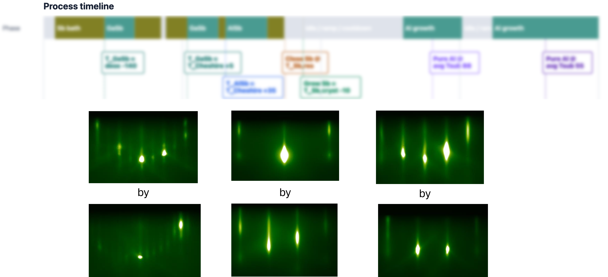
  <figcaption>
    Representative public RHEED/process-monitoring view showing selected diffraction patterns in the context of a redacted growth timeline. This supports resume claims around RHEED-guided reconstruction tracking, recipe-variable feedback, and in-situ growth-day decision support.
  </figcaption>
</figure>

## Structural Characterization

Status: `Public selected figure`

<figure>
  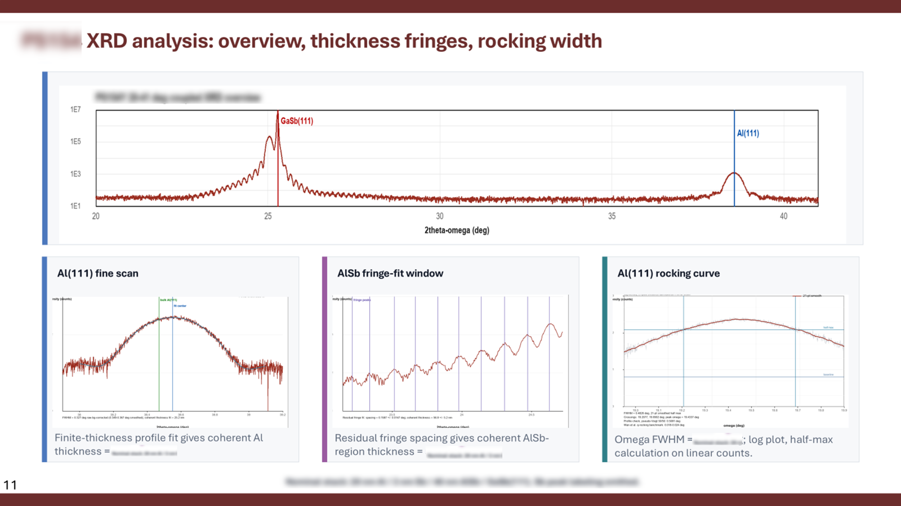
  <figcaption>
    Representative HRXRD analysis workflow showing an overview scan, fine-scan peak analysis, thickness-fringe window, and rocking-curve extraction. This supports resume claims around using HRXRD/XRR to quantify crystalline coherence, thickness, fringe structure, and rocking width.
  </figcaption>
</figure>

## TEM Diffraction And Phase Confirmation

Status: `Public selected figure`

<figure>
  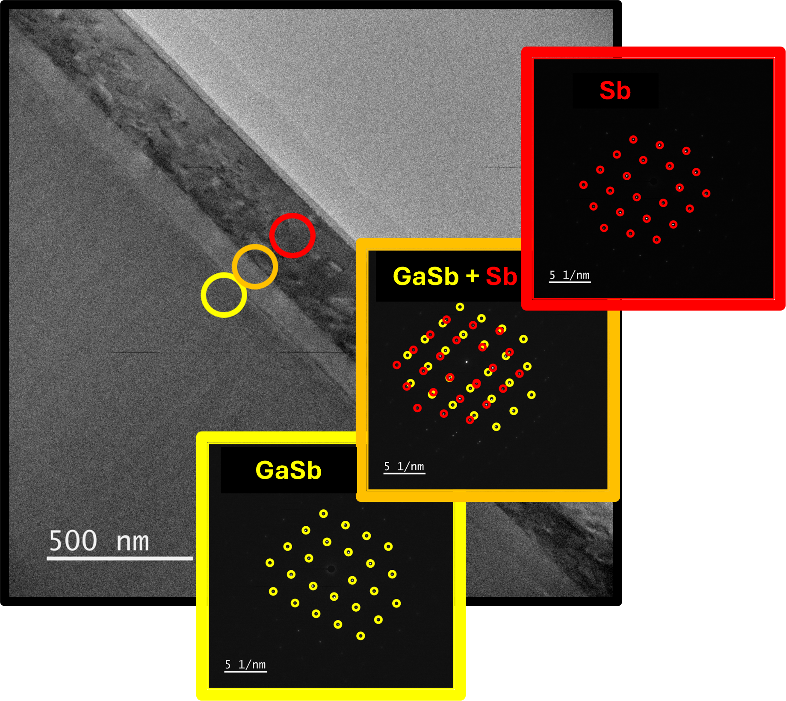
  <figcaption>
    Representative TEM and diffraction-pattern analysis used to compare substrate, interface, and film signatures in an Sb-based epitaxial system. This supports resume claims around interpreting TEM evidence for phase confirmation, epitaxial registry, and interface structure.
  </figcaption>
</figure>

## Reflectometry And Thickness Confirmation

Status: `Public selected figure`

<figure>
  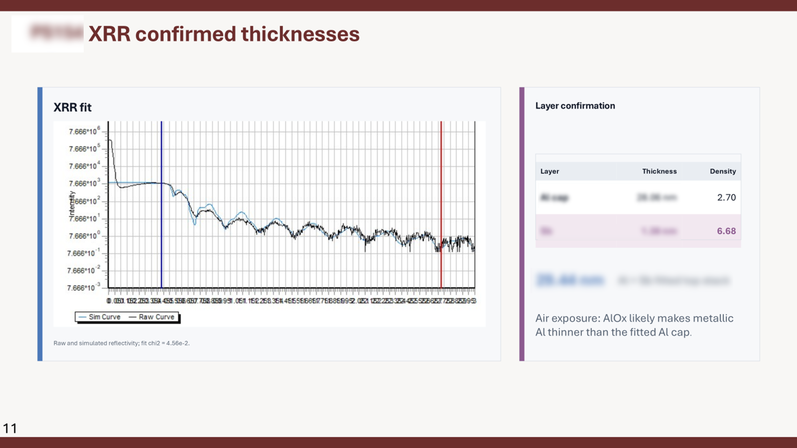
  <figcaption>
    Representative XRR fit and layer-confirmation summary. This illustrates model-versus-measurement comparison for thin-film thickness extraction and post-growth layer validation.
  </figcaption>
</figure>

## Surface Morphology

Status: `Public selected figure`

<figure>
  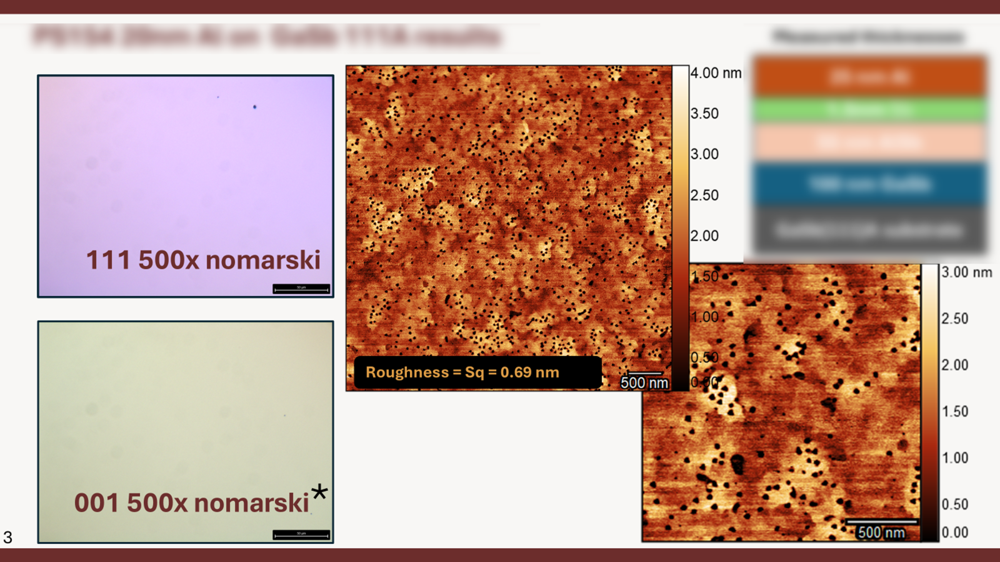
  <figcaption>
    Representative Nomarski and AFM morphology comparison used to evaluate surface texture and roughness after heterostructure growth. This supports resume claims around ex-situ morphology analysis feeding back into MBE recipe-variable updates.
  </figcaption>
</figure>

## Surface-Recovery Comparison

Status: `Public selected figure`

<figure>
  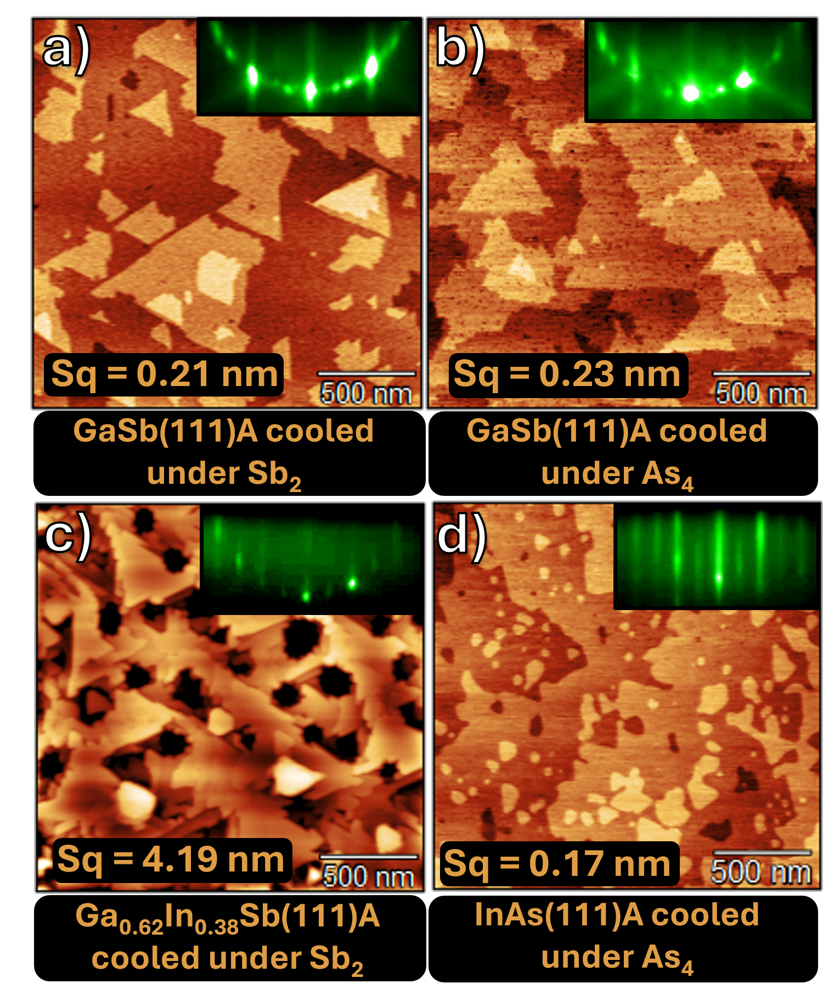
  <figcaption>
    Representative paired view of ex-situ AFM morphology and in-situ RHEED snapshots across related III-V surfaces and cooldown conditions. This illustrates how roughness, domain morphology, and diffraction-pattern feedback can be used together to refine surface-recovery and overgrowth strategies.
  </figcaption>
</figure>

## Cooldown-Ambient Morphology Comparison

Status: `Public selected figure`

<figure>
  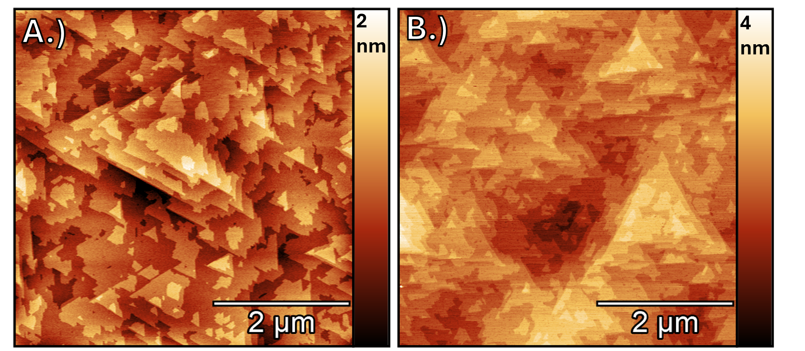
  <figcaption>
    Representative AFM comparison showing how cooldown ambient affects buffer-surface morphology and height-scale contrast. This supports process-window optimization by linking group-V ambient choice to ex-situ morphology feedback.
  </figcaption>
</figure>

## InAs Growth-Rate Morphology Series

Status: `Public selected figure`

<figure>
  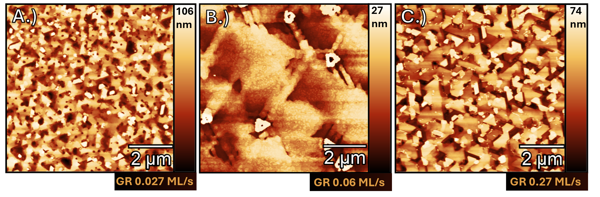
  <figcaption>
    Representative AFM growth-rate series showing morphology changes across nominal InAs growth-rate conditions. This illustrates how ex-situ morphology maps can guide growth-rate calibration, process-window selection, and MBE recipe-variable updates.
  </figcaption>
</figure>

## AFM Stack Morphology

Status: `Public selected figure`

<figure>
  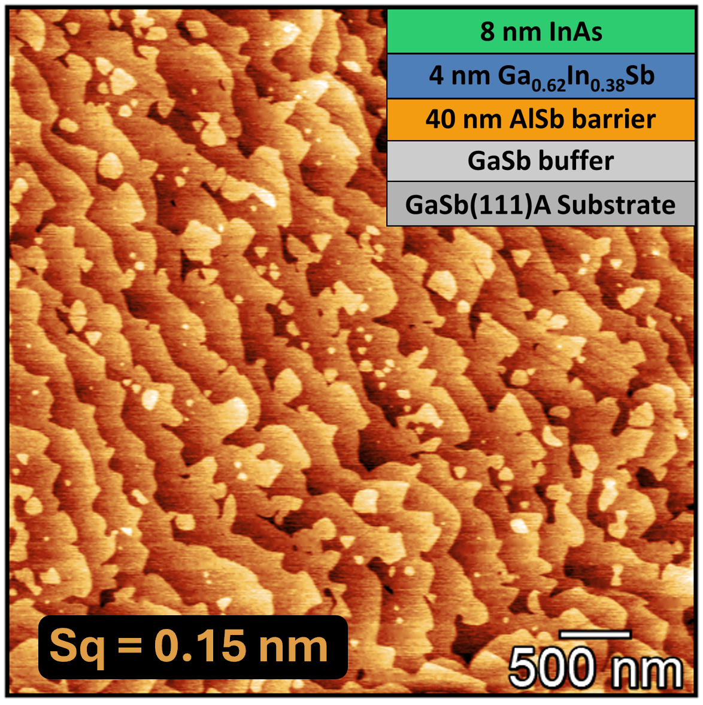
  <figcaption>
    Representative AFM height map with simplified heterostructure context. This illustrates ex-situ surface-roughness analysis and how cap/overgrowth choices can feed back into recipe design for smoother heterointerfaces.
  </figcaption>
</figure>

## Sb-Based Surface Preparation

Status: `Public selected figure`

<figure>
  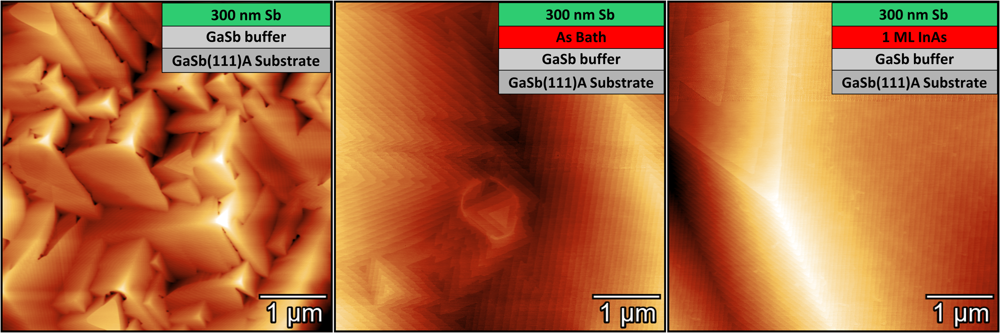
  <figcaption>
    Representative AFM comparison of Sb-based surface morphologies after different public-safe surface-preparation examples. This shows how interface conditioning and starting surface state can strongly change morphology.
  </figcaption>
</figure>

## Crystallographic Domain Orientation

Status: `Public selected figure`

<figure>
  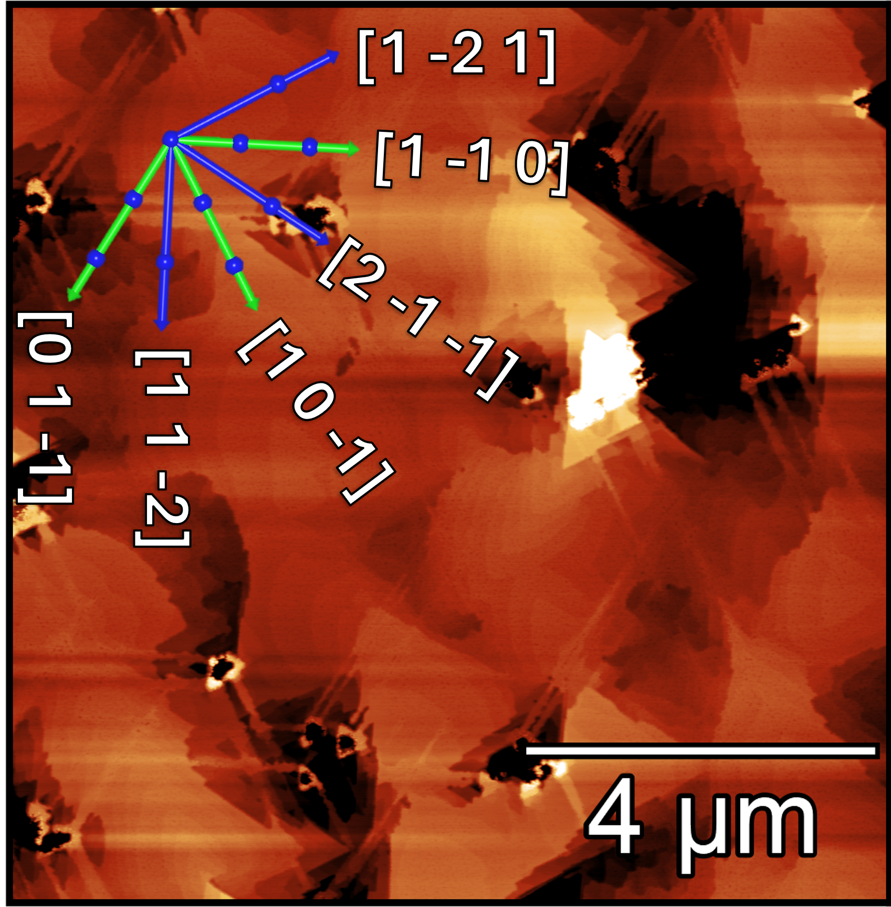
  <figcaption>
    Representative AFM morphology map with an in-plane crystallographic direction guide. This illustrates domain and facet-orientation interpretation for Sb-oriented surfaces.
  </figcaption>
</figure>

## Reciprocal-Space Mapping

Status: `Public selected figure`

<figure>
  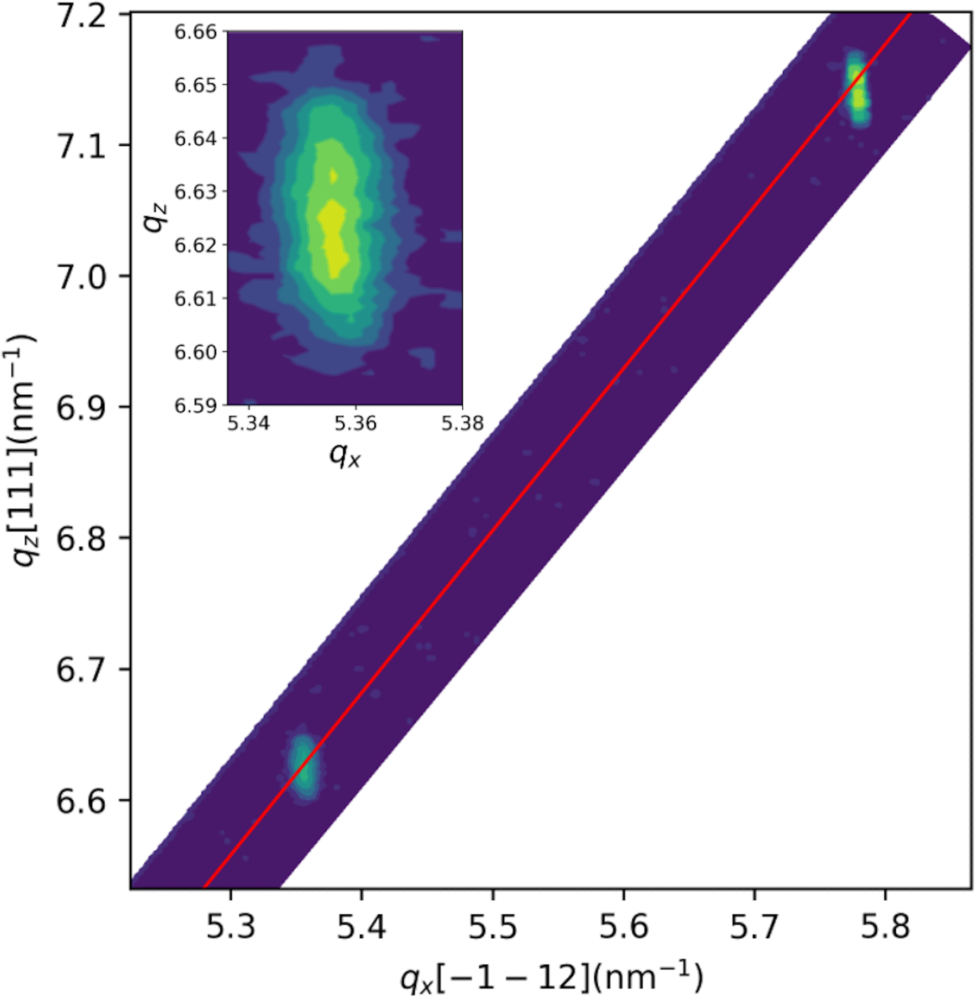
  <figcaption>
    Public reciprocal-space-map example used to visualize lattice relationship and strain-state information from XRD/RSM analysis. This supports resume claims around reciprocal-coordinate calibration, strain/relaxation visualization, and structural interpretation of epitaxial stacks.
  </figcaption>
</figure>

## Public Boundary

These figures are intended as resume-supporting examples, not as full research records. The private repository remains the source of truth for raw scans, full sample histories, growth databases, unredacted slide decks, and unpublished run-level details.
