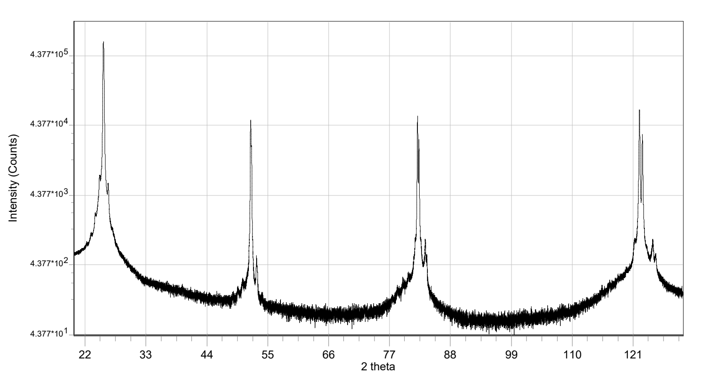
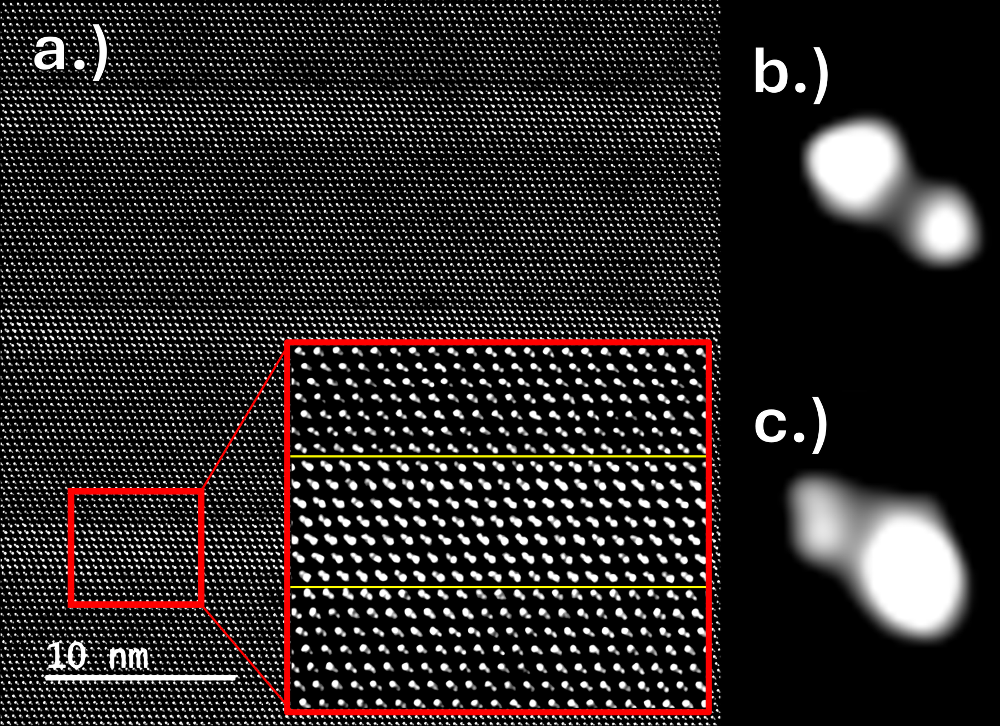
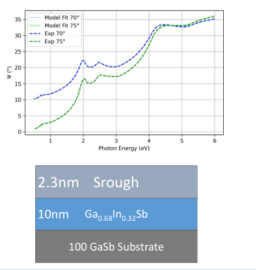
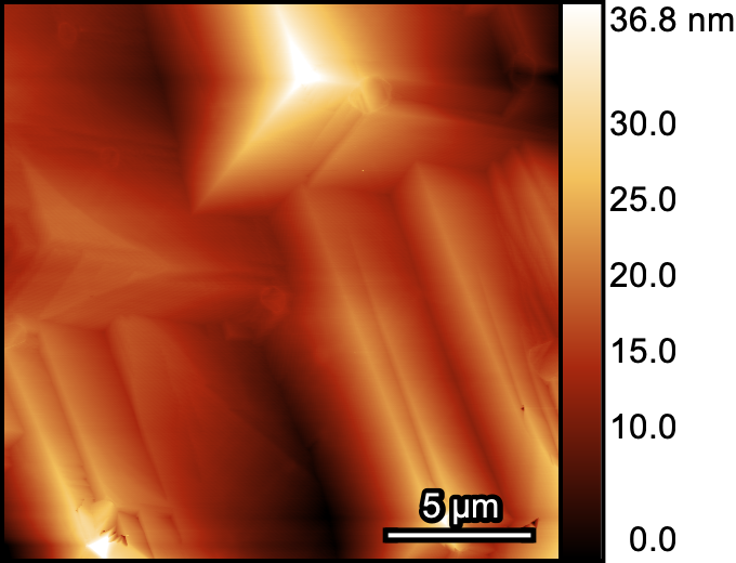
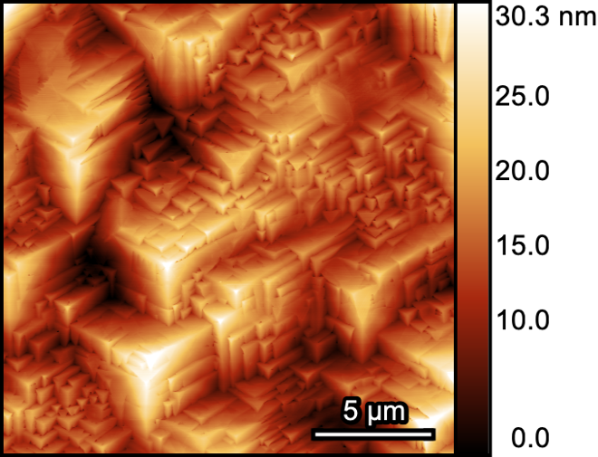
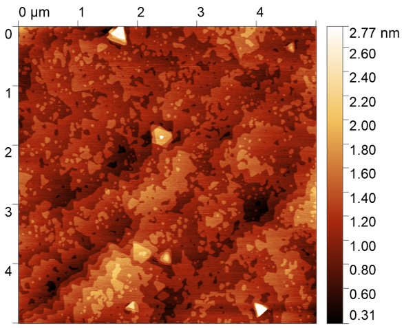
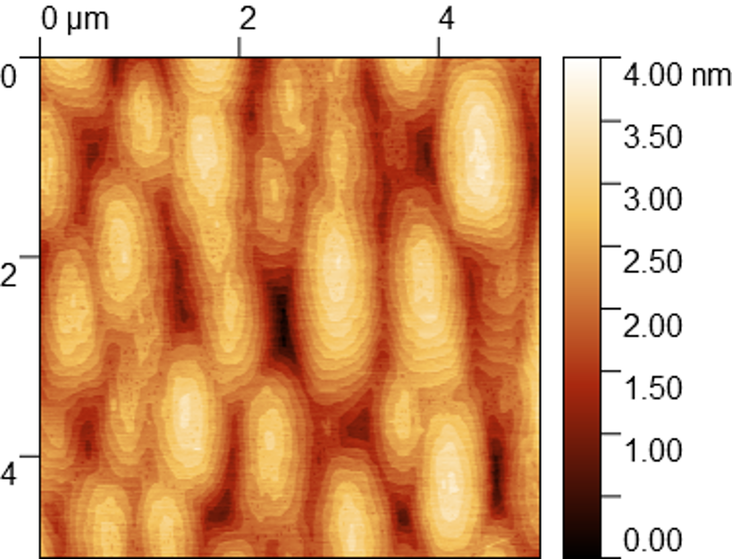
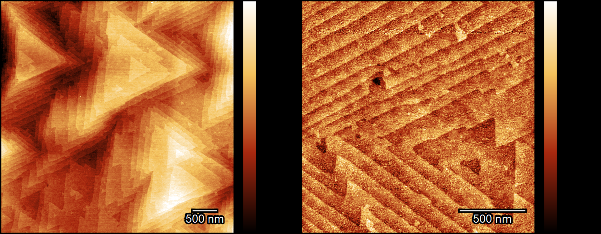

# Selected Research Figures

This page collects public-facing figure examples that show how growth, structural characterization, and morphology feedback are used to evaluate MBE heterostructures. The figures are sanitized slide or figure exports: sample identifiers, internal notes, exact run context, and private process details have been redacted or blurred.

## In-Situ RHEED Process Monitoring

Status: `Public selected figure`

<figure>
  
  <figcaption>
    Representative public RHEED/process-monitoring view showing selected diffraction patterns in the context of a redacted growth timeline. This supports resume claims around RHEED-guided reconstruction tracking, recipe-variable feedback, and in-situ growth-day decision support.
  </figcaption>
</figure>

## Structural Characterization

Status: `Public selected figure`

<figure>
  
  <figcaption>
    Representative HRXRD analysis workflow showing an overview scan, fine-scan peak analysis, thickness-fringe window, and rocking-curve extraction. This supports resume claims around using HRXRD/XRR to quantify crystalline coherence, thickness, fringe structure, and rocking width.
  </figcaption>
</figure>

## Wide-Range XRD Reflection Series

Status: `Public selected figure`

<figure>
  
  <figcaption>
    Representative wide-range XRD scan showing a higher-order reflection series from a (111)-oriented epitaxial stack. This illustrates orientation confirmation, higher-order peak tracking, and broad structural screening before more targeted HRXRD/RSM analysis.
  </figcaption>
</figure>

## TEM Diffraction And Phase Confirmation

Status: `Public selected figure`

<figure>
  
  <figcaption>
    Representative TEM and diffraction-pattern analysis used to compare substrate, interface, and film signatures in an Sb-based epitaxial system. This supports resume claims around interpreting TEM evidence for phase confirmation, epitaxial registry, and interface structure.
  </figcaption>
</figure>

## Atomic-Resolution TEM Interface Analysis

Status: `Public selected figure`

<figure>
  
  <figcaption>
    Representative atomic-resolution TEM figure used to inspect local lattice contrast, interface structure, and nanoscale heterostructure quality. The public version uses a neutral filename and caption without sample identifiers.
  </figcaption>
</figure>

## Reflectometry And Thickness Confirmation

Status: `Public selected figure`

<figure>
  
  <figcaption>
    Representative XRR fit and layer-confirmation summary. This illustrates model-versus-measurement comparison for thin-film thickness extraction and post-growth layer validation.
  </figcaption>
</figure>

## Optical Modeling And Thickness Screening

Status: `Public selected figure`

<figure>
  
  <figcaption>
    Representative optical-modeling example comparing measured and modeled spectra with a simple layer-stack schematic. This illustrates non-destructive thickness and roughness screening that can support rapid post-growth feedback when RHEED-based calibration is not the most direct measurement.
  </figcaption>
</figure>

## AFM Morphology And Process Feedback

Status: `Public selected figure set`

These AFM examples are grouped as a compact gallery so the section reads as a morphology workflow rather than a long sequence of isolated scans. Select any image to inspect the full-size figure.

  <figure>
    
    <figcaption><strong>Morphology overview.</strong> Nomarski plus AFM context for evaluating surface texture, roughness, and recipe feedback.</figcaption>
  </figure>

  <figure>
    
    <figcaption><strong>Large-area faceting.</strong> Wide-field AFM reveals domain structure and surface uniformity beyond a single roughness metric.</figcaption>
  </figure>

  <figure>
    
    <figcaption><strong>Terraced facets.</strong> Mesoscale scans distinguish facet evolution and terrace structure across larger length scales.</figcaption>
  </figure>

  <figure>
    
    <figcaption><strong>Fine-scale texture.</strong> Local scans track uniformity, feature density, and surface evolution at smaller length scales.</figcaption>
  </figure>

  <figure>
    
    <figcaption><strong>Anisotropic texture.</strong> Directional morphology indicates growth-mode changes relevant to epitaxial process tuning.</figcaption>
  </figure>

  <figure>
    
    <figcaption><strong>Surface recovery.</strong> Paired AFM/RHEED views connect ex-situ morphology with in-situ diffraction feedback.</figcaption>
  </figure>

  <figure>
    
    <figcaption><strong>Cooldown ambient.</strong> AFM comparison links group-V ambient choice to buffer-surface morphology and height-scale contrast.</figcaption>
  </figure>

  <figure>
    
    <figcaption><strong>Growth-rate series.</strong> Morphology maps guide growth-rate calibration, process-window selection, and recipe updates.</figcaption>
  </figure>

  <figure>
    
    <figcaption><strong>Stack morphology.</strong> Roughness analysis with layer context links cap/overgrowth choices to heterointerface quality.</figcaption>
  </figure>

## Sb-Based Surface Preparation

Status: `Public selected figure`

<figure>
  
  <figcaption>
    Representative AFM comparison of Sb-based surface morphologies after different public-safe surface-preparation examples. This shows how interface conditioning and starting surface state can strongly change morphology.
  </figcaption>
</figure>

## Elemental Sb Thin Film

Status: `Public selected figure`

<figure>
  
  <figcaption>
    Representative AFM height maps of an elemental Sb thin film, showing triangular domain morphology and surface texture at the 500 nm scale. This provides a public-facing example of Sb thin-film morphology analysis without exposing sample identifiers.
  </figcaption>
</figure>

## Crystallographic Domain Orientation

Status: `Public selected figure`

<figure>
  
  <figcaption>
    Representative AFM morphology map with an in-plane crystallographic direction guide. This illustrates domain and facet-orientation interpretation for Sb-oriented surfaces.
  </figcaption>
</figure>

## Reciprocal-Space Mapping

Status: `Public selected figure`

<figure>
  
  <figcaption>
    Public reciprocal-space-map example used to visualize lattice relationship and strain-state information from XRD/RSM analysis. This supports resume claims around reciprocal-coordinate calibration, strain/relaxation visualization, and structural interpretation of epitaxial stacks. Related published context: Madison D. Nordstrom et al., <a href="https://doi.org/10.1021/acs.cgd.3c00812">"Direct Integration of GaSb with GaAs(111)A Using Interfacial Misfit Arrays"</a>, <em>Crystal Growth & Design</em> 23(12), 8670-8677 (2023).
  </figcaption>
</figure>

## Public Boundary

These figures are intended as resume-supporting examples, not as full research records. The private repository remains the source of truth for raw scans, full sample histories, growth databases, unredacted slide decks, and unpublished run-level details.
